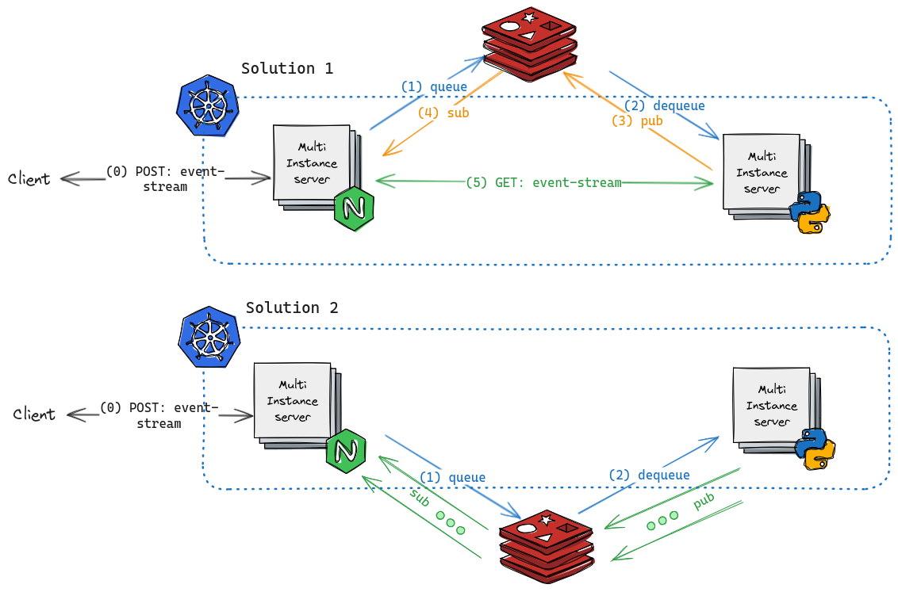

# PoC: Text Streaming between microservices inside K8s using Redis

Exploring ways to stream data between 2 microservices (`Node-MS` and `Python-MS`) inside k8s. 

Using Redis as a a median or a facilitator. 

  

## Solution 1:

- The client queries Node-MS with a text to be processed. Node-MS will keep the connection open.

- Node-Ms will publish a message with the text to be processed.

- After the message is received by Python-MS, it will publish a message containing its IP and the message ID.

- Node-MS, after receiving the message, will check if the ID belongs to that MS instance. If it does, it will send a GET request to Python-MS to get the data as a stream.

- Node-MS will forward the results to the client as a stream.

  

## Solution 2:

- We only use Redis Pub/Sub to communicate between microservices.

- The client queries Node-MS with a text to be processed. Node-MS will keep the connection open.

- Node-Ms will publish a message with the text to be processed.

- Python-MS will receive the message and process it.

- Python-MS will start publishing the results to a channel.

- Node-MS will subscribe to the channel and forward the results to the client.

  

